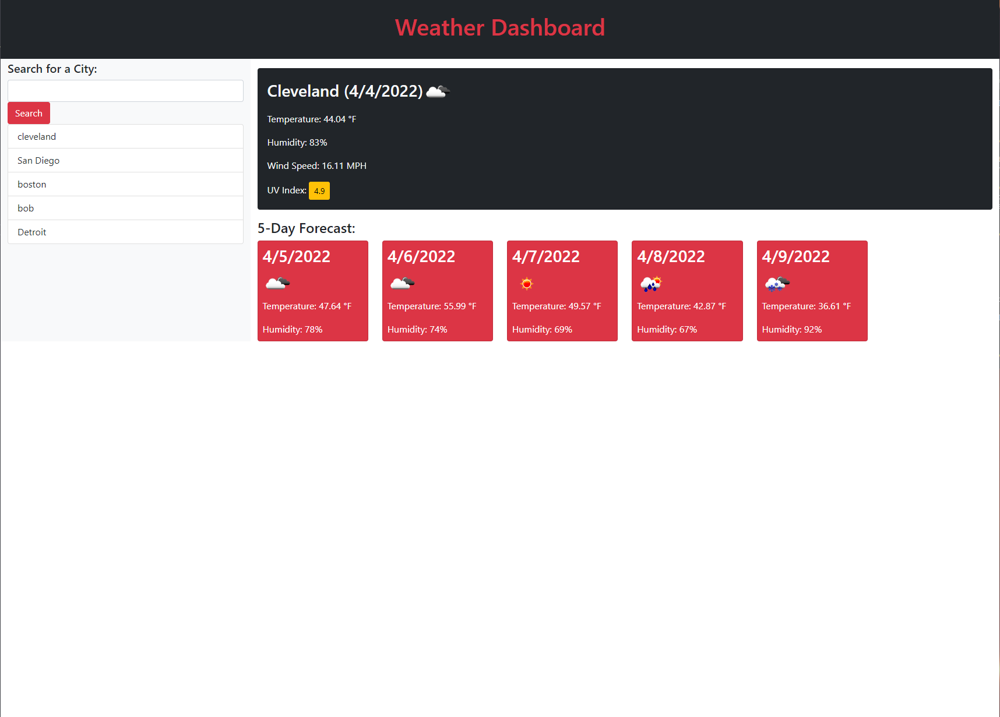

# My-Weather-Dashboard
## This is the module 6 challenge where I am making a weather dashboard website from scratch.

# User Story

```
AS A traveler
I WANT to see the weather outlook for multiple cities
SO THAT I can plan a trip accordingly
```

## Acceptance Criteria

```
GIVEN a weather dashboard with form inputs
WHEN I search for a city
THEN I am presented with current and future conditions for that city and that city is added to the search history
WHEN I view current weather conditions for that city
THEN I am presented with the city name, the date, an icon representation of weather conditions, the temperature, the humidity, the wind speed, and the UV index
WHEN I view the UV index
THEN I am presented with a color that indicates whether the conditions are favorable, moderate, or severe
WHEN I view future weather conditions for that city
THEN I am presented with a 5-day forecast that displays the date, an icon representation of weather conditions, the temperature, the wind speed, and the humidity
WHEN I click on a city in the search history
THEN I am again presented with current and future conditions for that city
```

## Whats been done
- added initial files
- linked bootstrap and jquery and all necessary files
- built out html with proper divs and sections and styled with bootstrap
- I then added psuedo code to start the script.js side of my project
- built a start function to start and load all the beginning data
- built click listener for search button that activates both the weather functions
- added ability for the items in local storage to be pulled and show in the search history
- built weather function with api that shows todays weather
- built weather forecast function that gives a five day forecast too


## Screenshot 



## Deployed Page

Page published at: https://nbross.github.io/My-Weather-Dashboard/
Git Hub Repo: https://github.com/nbross/My-Weather-Dashboard